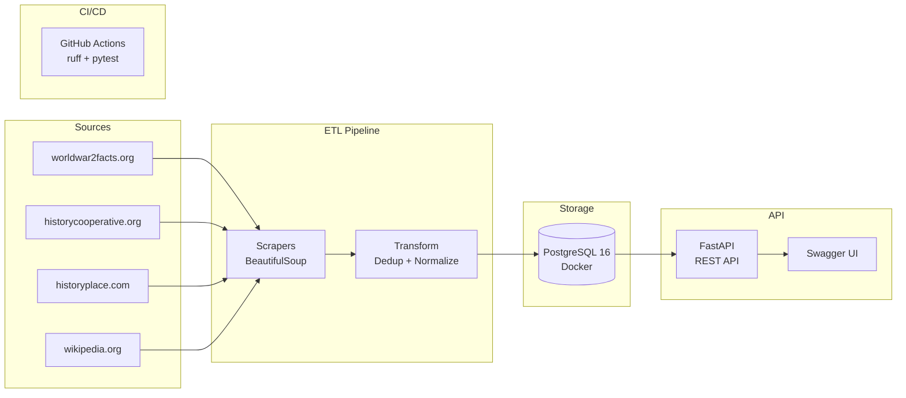

# WW2 ETL Project

Data engineering pipeline to collect, normalize, and serve historical events from World War II.

## Motivation

I'm passionate about data engineering and military history. World War II is one of the conflicts that fascinates me the most — the scale, the turning points, the human stories behind each event. I wanted to combine both interests into a single project: build a real data pipeline that collects, deduplicates, and serves historical events from multiple sources. The result is both a technical challenge and something I genuinely care about.

## Architecture



## Description

This project implements an ETL (Extract, Transform, Load) pipeline:
- **Extract**: Web scraping from 4 sources on World War II events
- **Transform**: Normalization, cross-source deduplication, and data cleaning
- **Load**: Storage in PostgreSQL with a normalized schema (6 tables)
- **API**: REST API with FastAPI to query events

## Tech Stack

- **Python 3.9+**
- **PostgreSQL 16** (via Docker)
- **SQLAlchemy 2.0** (ORM with `Mapped[]` syntax)
- **Alembic** (schema migrations)
- **BeautifulSoup4** (web scraping)
- **FastAPI** (REST API)
- **Docker Compose** (infrastructure)

## Project Structure

```
WW2-ETL/
├── src/                        # Main source code
│   ├── etl/                    # ETL modules
│   │   ├── collector.py        # Pipeline orchestrator
│   │   ├── scrapers.py         # 3 scrapers (WorldWar2Facts, HistoryCooperative, HistoryPlace)
│   │   └── scrape_result.py    # Scraping result DTO
│   ├── models/                 # Data models
│   │   ├── base.py             # SQLAlchemy engine, Base, SessionLocal
│   │   ├── event.py            # 6 ORM models (Event, Source, EventSource, ScrapeRun, Tag, EventTag)
│   │   └── raw_event.py        # RawEventData dataclass (scraper DTO)
│   ├── utils/                  # Utilities
│   │   ├── database.py         # DatabaseManager (SQLAlchemy sessions)
│   │   └── date_parser.py      # Multi-format date parser
│   ├── api/                    # REST API
│   │   ├── main.py             # FastAPI app, CORS, routers
│   │   ├── deps.py             # Dependency injection (DB session)
│   │   ├── schemas.py          # Pydantic response models
│   │   └── routes/             # Endpoints
│   │       ├── events.py       # /api/v1/events, /api/v1/events/random
│   │       └── stats.py        # /api/v1/stats
├── config/                     # Configuration
│   └── settings.py             # Centralized settings + dotenv
├── alembic/                    # Database migrations
│   ├── env.py                  # Alembic configuration
│   └── versions/               # Migration scripts
├── scripts/                    # Entry points
│   ├── run_etl.py              # Run ETL pipeline
│   └── run_api.py              # Run REST API
├── tests/                      # Tests
│   ├── conftest.py             # Fixtures (SQLite in-memory)
│   ├── test_database.py        # DatabaseManager tests
│   └── test_date_parser.py     # Date parser tests
├── docs/                       # Documentation
├── docker-compose.yml          # PostgreSQL + pgAdmin
├── pgadmin-servers.json        # pgAdmin auto-config
├── alembic.ini                 # Alembic config
├── .env.example                # Environment variables template
├── requirements.txt            # Python dependencies
└── setup.py                    # Package configuration
```

## Setup

### Requirements

- Python 3.9+
- Docker and Docker Compose

### Installation

1. **Clone the repository**:
```bash
git clone https://github.com/jucmunozar/ww2-etl.git
cd ww2-etl
```

2. **Create virtual environment**:
```bash
python -m venv venv
source venv/bin/activate
```

3. **Install dependencies**:
```bash
pip install -r requirements.txt
```

4. **Configure environment variables**:
```bash
cp .env.example .env
```

5. **Start PostgreSQL**:
```bash
docker compose up -d
```

6. **Apply migrations**:
```bash
alembic upgrade head
```

## Usage

### Run the ETL Pipeline

```bash
python scripts/run_etl.py
```

This runs all scrapers, records a `scrape_run` for each one, and saves normalized events to PostgreSQL.

### View Statistics

```python
from src.utils.database import DatabaseManager

dm = DatabaseManager()
dm.print_stats()
```

### Run Tests

```bash
pytest tests/ -v
```

Tests use SQLite in-memory automatically — no Docker or PostgreSQL needed.

### REST API

```bash
python scripts/run_api.py
```

Open http://localhost:8000/docs for interactive Swagger UI.

**Available endpoints:**

| Method | Route | Description |
|--------|-------|-------------|
| GET | `/api/v1/events?date=1941-12-07` | Events by exact date |
| GET | `/api/v1/events?year=1942` | Events by year |
| GET | `/api/v1/events?month=6&day=6` | "On this day" (any year) |
| GET | `/api/v1/events/random` | Random event |
| GET | `/api/v1/stats` | Statistics (total, by source, by year) |

All list endpoints include pagination with `limit` (default 20, max 100) and `offset`.

## Deployment

Currently runs locally via Docker Compose. Planned production architecture on AWS:

- **AWS Lambda + API Gateway** to serve the API (serverless, auto-scaling, pay-per-request)
- **AWS RDS PostgreSQL** for the database

## Database

Normalized schema with 6 tables:

```
events          Unique events (deduplicated by date + title)
sources         Data source catalog
event_sources   Event <-> source link (cross-source dedup)
scrape_runs     Record of each scraper execution
tags            Tags/categories for events
event_tags      Event <-> tag link
```

Deduplication works as follows: if the same event appears in 2 different sources, it is stored **once** in `events` and linked to both sources in `event_sources`.

## Data Sources

| Source | URL | Events |
|--------|-----|--------|
| worldwar2facts.org | worldwar2facts.org/timeline | ~173 |
| historycooperative.org | historycooperative.org/ww2-dates/ | ~243 |
| historyplace.com | historyplace.com/worldwar2/timeline/ww2time.htm | ~36 |
| wikipedia.org | en.wikipedia.org/api/rest_v1 | ~1938 |

**Total**: ~2,390 unique events (1918-1945)

## pgAdmin

To explore the database visually:

```bash
docker compose up -d pgadmin
```

Open http://localhost:5050 — Login: `admin@ww2etl.com` / `admin`
